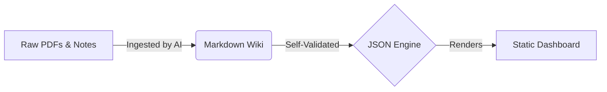

# Lumina: The Autonomous Patient Dossier

Lumina is an open-source, multi-agent AI framework for personal health management. It uses Agentic IDEs (like Cursor, Windsurf, or Cline) to automatically ingest messy medical records, build a structured markdown knowledge graph, and compile it into a visual dashboard.

## 🧬 How It Works

Lumina operates as a background intelligence engine that permanently organizes your data using a strict, zero-hallucination workflow.

## 🚀 Getting Started

Lumina is a **Self-Bootstrapping, Set-And-Forget Workspace**. 

1. **Download** this repository.
2. **Open** the folder in *any* Agentic IDE (Cursor, Windsurf, Copilot, Cline). Lumina ships with universal pointers that instruct the IDE out-of-the-box.
3. **Drop Files**: Put your medical PDFs in the `/raw/` folder.
4. **Command the AI**: Tell the AI to "Ingest the new files."
5. **Read**: The system will autonomously build the `/wiki/` and update the dashboard. For more details, read `USER_MANUAL.md`.

## 🔒 Privacy & Safety First
- **Zero Hallucination Guarantee:** The AI is strictly prompted to use a Provenance Protocol. It must cite the exact raw file for every metric it records.
- **Local First:** Your data never leaves your computer. Ensure your AI tools are configured with **Zero Data Retention** policies.

## 🌟 Acknowledgments
This open-source project was taken inspiration from Andrej Karpathy's [bio prompt gist](https://gist.github.com/karpathy/442a6bf555914893e9891c11519de94f).
