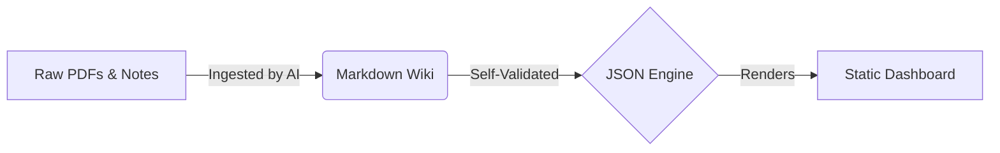

# Lumina: The Autonomous Patient Dossier Framework

[]()
[]()
[]()

Lumina is an open-source, multi-agent AI framework for personal health management. This repository acts as a **factory** to bootstrap independent "Patient Dossiers."

Once generated, a dossier uses your Agentic IDE (Cursor, Windsurf, Copilot, or Cline) to automatically ingest messy medical records, build a structured markdown knowledge graph, and compile it into a premium visual dashboard.

## 🧬 How It Works

Lumina operates as a background intelligence engine that permanently organizes your data using a strict, zero-hallucination workflow.



## 🚀 Getting Started

To create a new Patient Dossier:

1. **Clone or Download** this repository.
2. **Run the Bootstrap Script**: Use the included python script to generate a new dossier folder anywhere on your computer.
   ```bash
   python3 bootstrap.py /path/to/YourNewPatientDossier
   ```
3. **Open the New Dossier**: Open the newly created folder (`YourNewPatientDossier`) in your Agentic IDE. Do NOT open the root `Lumina` folder in your IDE to manage health data.
4. **Drop Files**: Put your medical PDFs in the `/raw/` folder of the new dossier.
5. **Command the AI**: Open the IDE chat and say: _"I added a new lab report. Ingest it."_
6. **Read**: The system will autonomously build the `/wiki/` and update the local web dashboard. For detailed instructions on using the generated dossier, read `USER_MANUAL.md`.

## 🔒 Privacy & Safety First

- **Zero Hallucination Guarantee:** The AI is strictly prompted to use a Provenance Protocol. It must cite the exact raw file for every metric it records.
- **Hyper-Personalized Constraints:** Configure `.ai/patient-constraints.md` in your dossier to enforce strict boundaries regarding drug interactions, allergies, or lifestyle constraints.
- **Local First:** Your data never leaves your computer. Ensure your AI tools are configured with **Zero Data Retention** policies.

## 🌟 Acknowledgments

This open-source project was taken inspiration from Andrej Karpathy's [bio prompt gist](https://gist.github.com/karpathy/442a6bf555914893e9891c11519de94f).
